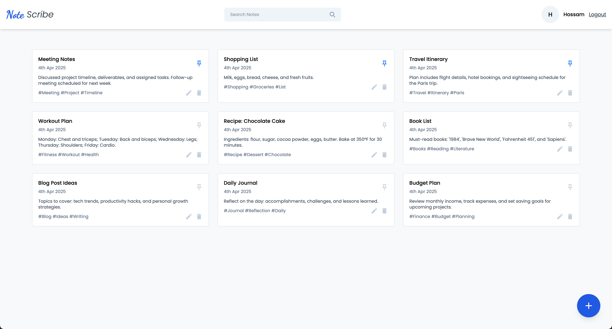
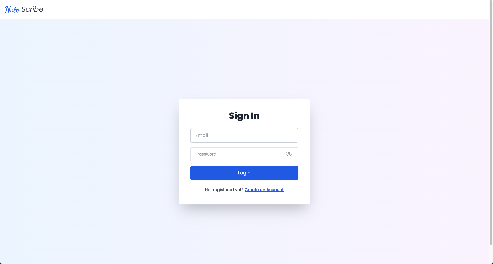
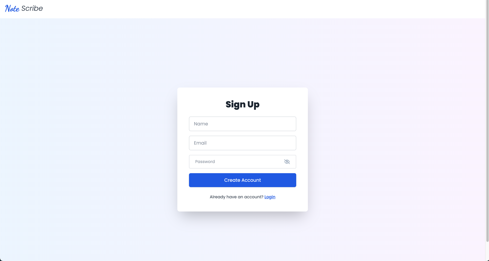

# Notes App

A full-stack MERN Notes App built as a practice project to sharpen skills in modern web development. This application features user authentication, note management (create, edit, delete, pin), and search functionality. The backend is powered by Node.js, Express, and MongoDB, while the frontend is built with React and Vite.

## Live Demo

Experience the live Dashboard of the Notes App here:  
[https://notesappfrontend-olive.vercel.app/dashboard](https://notesappfrontend-olive.vercel.app/dashboard)

## Screenshots

### Dashboard

### Login Page

### Signup Page

## Features

- **User Authentication:** Secure registration and login using JSON Web Tokens (JWT).
- **Note Management:** Create, edit, delete, and pin notes.
- **Search:** Filter notes with a responsive search bar.
- **Responsive UI:** A modern, mobile-friendly design with a clean layout.
- **Full-Stack Integration:** Backend API built with Express and MongoDB; frontend built with React and Vite.

## Technologies Used

- **Backend:** Node.js, Express, MongoDB, Mongoose, JSON Web Tokens (JWT)
- **Frontend:** React, Vite, React Router, Tailwind CSS, React Icons
- **Deployment:** Vercel

